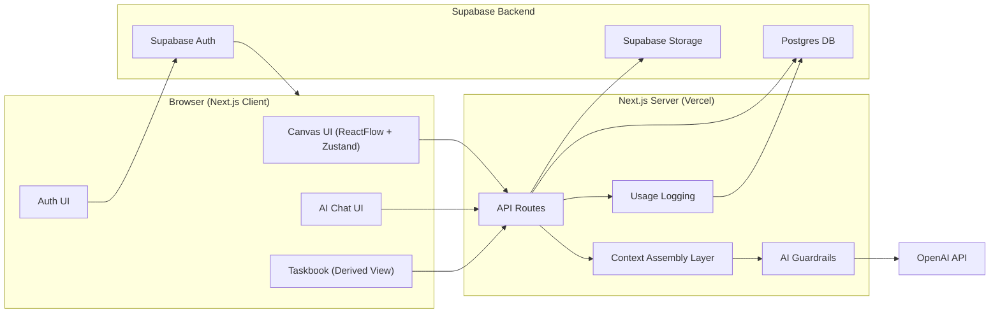

# System Architecture

```mermaid
flowchart LR

    subgraph Client["Browser (Next.js Client)"]
        CanvasUI["Canvas UI (ReactFlow + Zustand)"]
        ChatUI["AI Chat UI"]
        TaskbookUI["Taskbook (Derived View)"]
        AuthUI["Auth UI"]
    end

    subgraph Server["Next.js Server (Vercel)"]
        APIRoutes["API Routes"]
        ContextAssembly["Context Assembly Layer"]
        Guardrails["AI Guardrails"]
        UsageLogger["Usage Logging"]
    end

    subgraph Supabase["Supabase Backend"]
        DB["Postgres DB"]
        Auth["Supabase Auth"]
        Storage["Supabase Storage"]
    end

    OpenAI["OpenAI API"]

    %% Client interactions
    CanvasUI --> APIRoutes
    ChatUI --> APIRoutes
    TaskbookUI --> APIRoutes
    AuthUI --> Auth

    %% Server responsibilities
    APIRoutes --> ContextAssembly
    ContextAssembly --> Guardrails
    Guardrails --> OpenAI
    APIRoutes --> UsageLogger

    %% Persistence
    APIRoutes --> DB
    UsageLogger --> DB
    APIRoutes --> Storage

    %% Auth
    Auth --> Client
```
