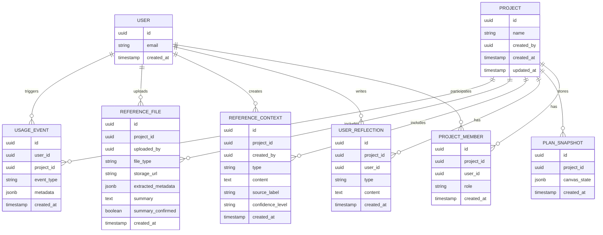

# Entity Relationship Diagram

```mermaid
erDiagram
    USER {
        uuid id
        string email
        timestamp created_at
    }

    PROJECT {
        uuid id
        string name
        uuid created_by
        timestamp created_at
        timestamp updated_at
    }

    PROJECT_MEMBER {
        uuid id
        uuid project_id
        uuid user_id
        string role
        timestamp created_at
    }

    PLAN_SNAPSHOT {
        uuid id
        uuid project_id
        jsonb canvas_state
        timestamp created_at
    }

    USER_REFLECTION {
        uuid id
        uuid project_id
        uuid user_id
        string type
        text content
        timestamp created_at
    }

    REFERENCE_CONTEXT {
        uuid id
        uuid project_id
        uuid created_by
        string type
        text content
        string source_label
        string confidence_level
        timestamp created_at
    }

    REFERENCE_FILE {
        uuid id
        uuid project_id
        uuid uploaded_by
        string file_type
        string storage_url
        jsonb extracted_metadata
        text summary
        boolean summary_confirmed
        timestamp created_at
    }

    USAGE_EVENT {
        uuid id
        uuid user_id
        uuid project_id
        string event_type
        jsonb metadata
        timestamp created_at
    }

    USER ||--o{ PROJECT_MEMBER : participates
    PROJECT ||--o{ PROJECT_MEMBER : has

    PROJECT ||--o{ PLAN_SNAPSHOT : stores
    PROJECT ||--o{ USER_REFLECTION : has
    PROJECT ||--o{ REFERENCE_CONTEXT : includes
    PROJECT ||--o{ REFERENCE_FILE : includes
    PROJECT ||--o{ USAGE_EVENT : generates

    USER ||--o{ USER_REFLECTION : writes
    USER ||--o{ REFERENCE_CONTEXT : creates
    USER ||--o{ REFERENCE_FILE : uploads
    USER ||--o{ USAGE_EVENT : triggers
```
